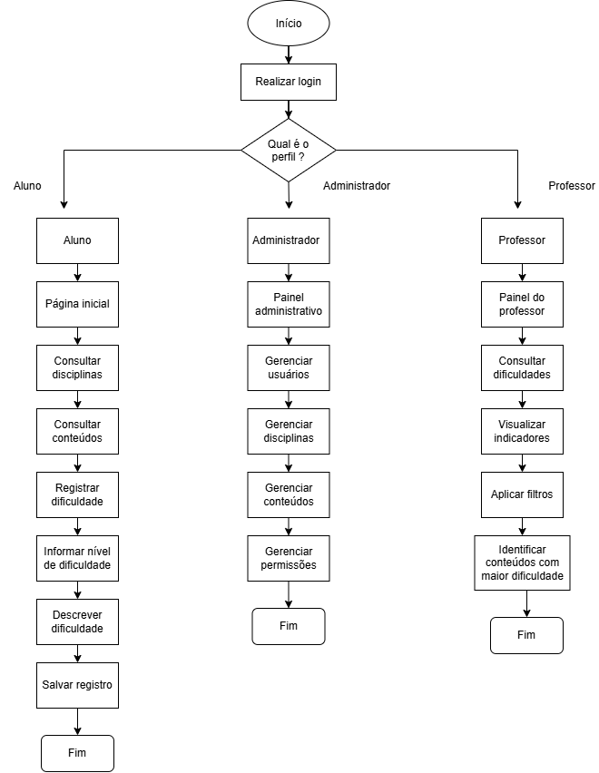
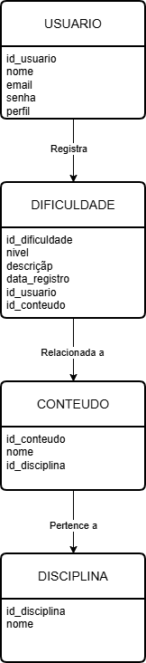
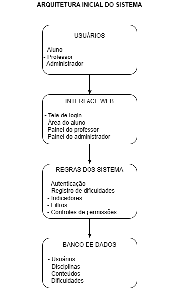

# Arquitetura e Modelagem do Sistema

## 1. Introdução

Este documento apresenta a modelagem inicial do Sistema de Identificação de Dificuldades nas Disciplinas, desenvolvido no Projeto Integrador II.

A modelagem tem como objetivo representar o funcionamento do sistema, sua estrutura de dados, sua arquitetura inicial e as principais interfaces previstas.

## 2. Usuários

O sistema possui três perfis principais:

### Aluno

O aluno poderá consultar disciplinas e conteúdos, registrar dificuldades, informar o nível de dificuldade, descrever dúvidas e consultar seus registros anteriores.

### Professor

O professor poderá consultar as dificuldades registradas pelos alunos, visualizar conteúdos com maior índice de dificuldade, aplicar filtros e acompanhar indicadores.

### Administrador

O administrador será responsável pelo gerenciamento de usuários, disciplinas, conteúdos e permissões.

## 3. Fluxo do sistema

O fluxo representa as principais ações realizadas pelos usuários de acordo com seus perfis.

## 4. Modelagem de dados

A modelagem considera as principais informações utilizadas pelo sistema:

- Usuário;
- Disciplina;
- Conteúdo;
- Dificuldade.

As entidades estão relacionadas de forma a permitir que os registros de dificuldade sejam associados aos alunos e aos conteúdos das disciplinas.

## 5. Arquitetura inicial

A arquitetura inicial foi organizada em camadas:

- Interface;
- Regras do sistema;
- Banco de dados.

A interface será responsável pela interação com os usuários. As regras do sistema serão responsáveis pelo processamento das informações e pelo controle das funcionalidades. O banco de dados armazenará as informações dos usuários, disciplinas, conteúdos e dificuldades.

## 6. Protótipos

Foi elaborado um protótipo inicial da interface principal do sistema, representando o processo de registro de uma dificuldade pelo aluno. O protótipo apresenta os principais campos necessários para o registro, como disciplina, conteúdo, nível de dificuldade e descrição.

## 7. Relação com os requisitos

A modelagem foi desenvolvida com base nos requisitos definidos na Etapa 1, especialmente os requisitos relacionados à consulta de disciplinas e conteúdos, registro e consulta de dificuldades, indicadores, filtros e gerenciamento do sistema.

## 8. Considerações finais

A modelagem apresentada representa uma versão inicial da solução. Os elementos poderão ser aprimorados durante as próximas etapas do desenvolvimento do projeto.
